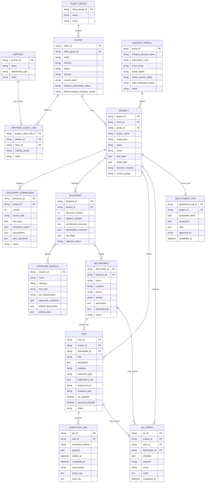

# Domain Model

## Core relationships

## Relationship notes

- A `Partner` is not the same thing as a `Client`. It represents an intermediary, implementation partner, or commercial route to the work.
- A `Client Group` can contain multiple operational `Client` entities that should still be modeled separately when they have distinct businesses or HubSpot portals.
- A `Project` belongs to exactly one `Client` and one target `HubSpot Portal`.
- A `Project` should not be reclassified to the partner just because the work is being delivered through that partner.
- Partner visibility should be granted through explicit partner-client relationships or access rules.
- A `Project` can have multiple `Discovery Submission` versions, but the approved blueprint should point to one discovery version.
- A `Blueprint` can apply multiple `Standard Module` records.
- `Deliverable` is the scoped output layer between blueprint design and execution tasks.
- `Task` is the operational unit that gets tracked on the internal board and routed by execution type.
- `Execution Job` is optional and only exists when a task is actually run through an API or agent path.
- `QA Check` may attach to a task or a deliverable depending on the level being validated.
- A `Deployment Log` closes the project and records approved outcomes and exceptions.

## Modeling examples

- `Tusk` can be modeled as a `Partner`
- `Magnisol` can be modeled as a `Client`
- `Tusk -> Magnisol` visibility should be represented through a partner-client link, not by making `Tusk` the client
- `EPIUSE` can be modeled as a `Client Group`
- `EPIUSE UK`, `EPIUSE ZA`, `EPIUSE AUS`, `EPIUSE USA West`, `EPIUSE Brazil`, `EPIUSE Spain`, and `EPIUSE DACH` should be modeled as separate `Client` entities linked to the `EPIUSE` client group because they have separate HubSpot portals and operate as distinct businesses
